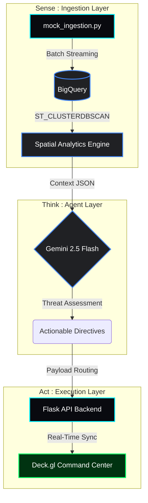

# Design.md: AuraSpatial
## Agentic Digital Twin for Stadium Operations

### 1. Executive Summary
**AuraSpatial** is a real-time spatial twin and decision-support system designed for large-scale sporting venues. By integrating high-velocity spatial data processing with Agentic AI, the system predicts crowd bottlenecks, automates emergency routing, and optimizes staff deployment through a "Geospatial Brain."

### 2. Challenge Vertical
* **Vertical:** Stadium Infrastructure & Crowd Safety.
* **Persona:** Operations Incident Commander (The "Controller").
* **Core Innovation:** Spatial-Aware RAG (Retrieval-Augmented Generation) utilizing Vectorized Trajectories rather than just text.

### 3. System Architecture & Component Diagram
The AuraSpatial Engine operates on a rapid **Sense-Think-Act** loop.

#### A. The Data Plane (Sense)
* **PoC Prototype:** A dynamic Python `mock_ingestion` tracking engine simulates independent Fan trajectories and pushes batched arrays directly into target BigQuery Datasets.
* **Production Vision:** IoT sensors (CCTV, Wi-Fi pings, BLE beacons) streamed via **Google Cloud Pub/Sub** into **Dataflow** for 0-latency spatial joins.
* **Storage:** **BigQuery Geospatial** actively shreds historical footprints older than 15 minutes to guarantee crisp real-time footprinting and cluster aggregations.

#### B. The Reasoning Engine (Think)
* **Spatial RAG:** The backend extracts Gate Occupancy arrays and Hotspots directly from BigQuery and dumps them into a highly-compressed JSON dictionary. 
* **Agentic Logic (Gemini 2.5):** The Operations Commander Agent consumes the lightweight Spatial Context and assesses bottlenecks.
    1. Cross-references Hotspot size vs Gate Capacity.
    2. Dynamically isolates the safest egress vector.
    3. Outputs tactical Ground Staff commands directly to the CLI/UI.

#### C. The Execution Layer (Act)
* **Command Center:** A lightweight Flask proxy serves a visually stunning 3D WebGL dashboard built with **Deck.gl** and Carto tiles. Responsive API polling securely extracts the Gemini intelligence and formats the markdown physically into a cyber-styled heads-up display.
* **Production Vision:** Direct API hooks to LED digital signage arrays in stadium concourses or push notifications to security radios.

### 4. Logical Decision Flow
The system operates on the fundamental flow-density relationship:
$$q = \rho \cdot v$$
*Where $q$ is flow, $\rho$ is density, and $v$ is velocity.*

**The Agent's Decision Matrix:**
* **IF** $\rho > \text{Threshold}$ AND $v < \text{Critical Velocity}$:
    * **Action:** Identify "Spatial Sink" (unoccupied area).
    * **Action:** Generate "Egress Pivot" for ground staff.
    * **Action:** Update LED Wayfinding.

### 5. Google Services Integration
| Service | Implementation Detail |
| :--- | :--- |
| **Vertex AI** | Gemini 2.5 Flash for reasoning; Vector Search for Spatial RAG. |
| **CARTO** | Maps for high-fidelity venue visualization. |
| **BigQuery** | Analyzing "Hotspot" history to predict issues. |
| **Cloud Run** | Hosting Agentic microservices for low-latency responses. |
